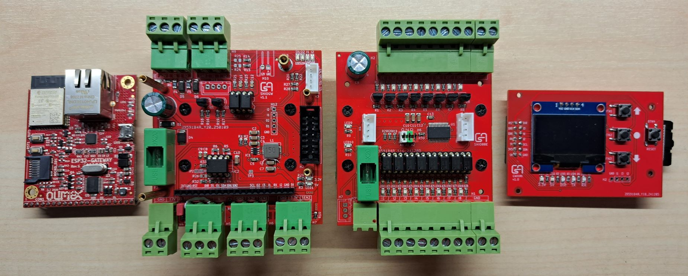
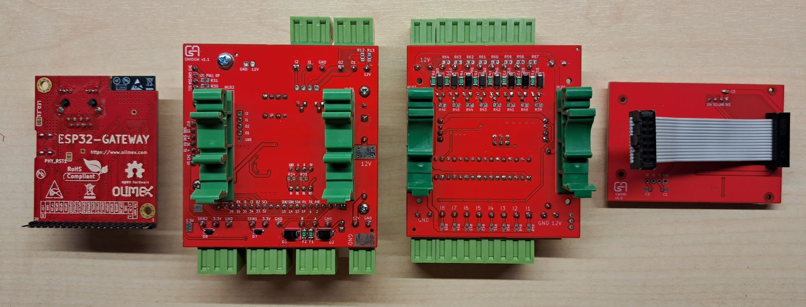
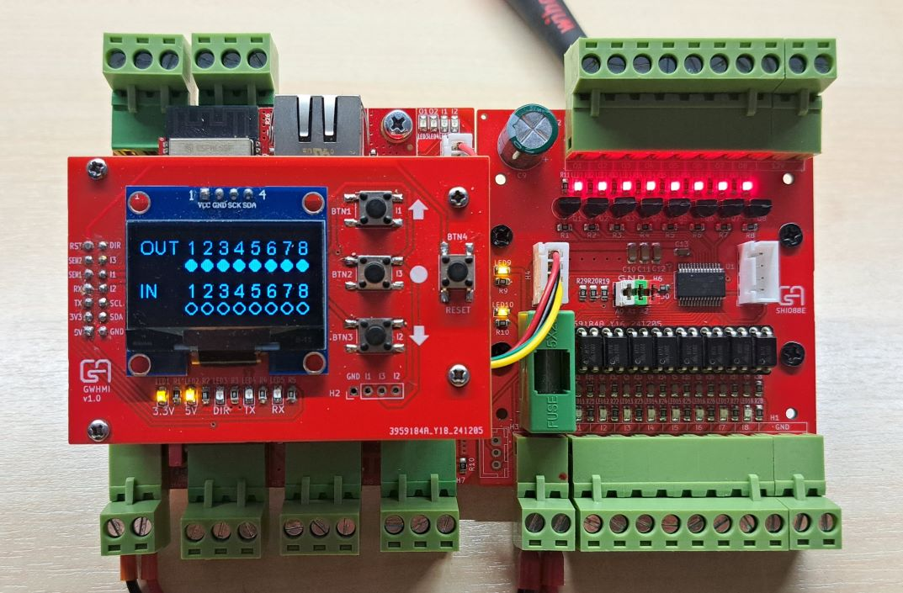
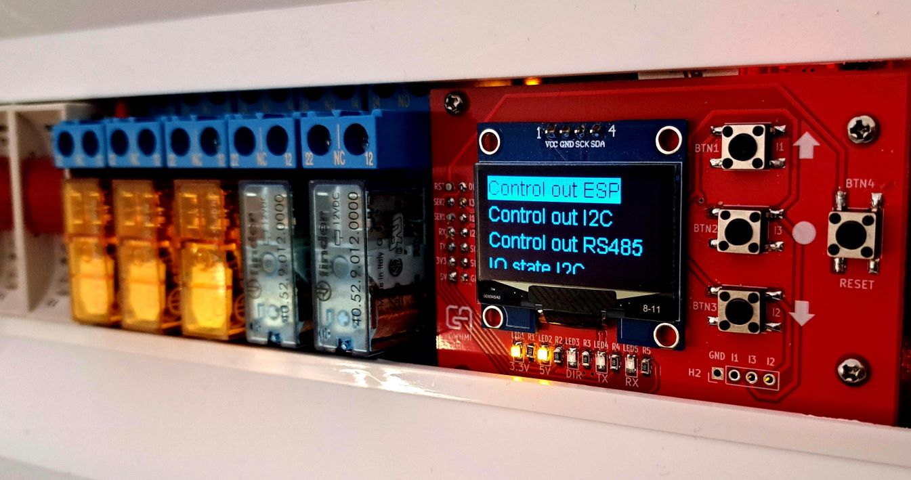
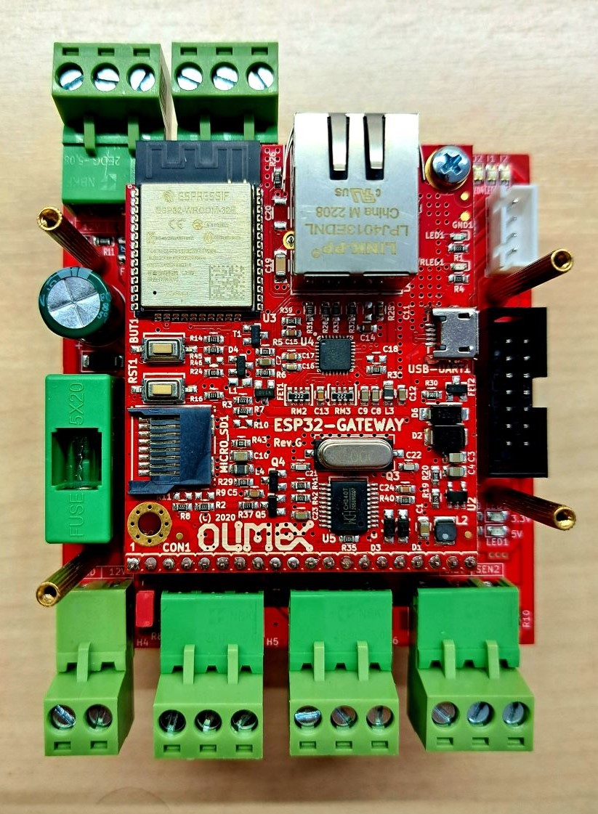
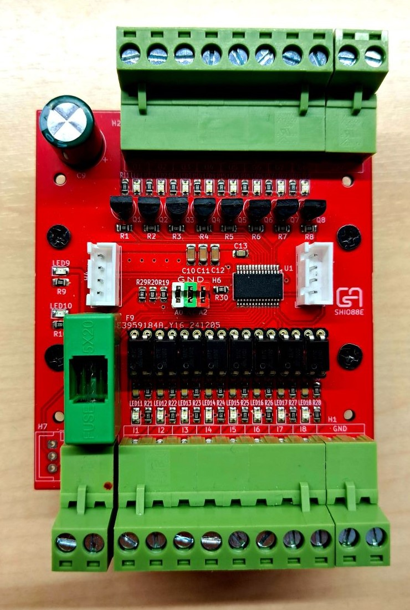
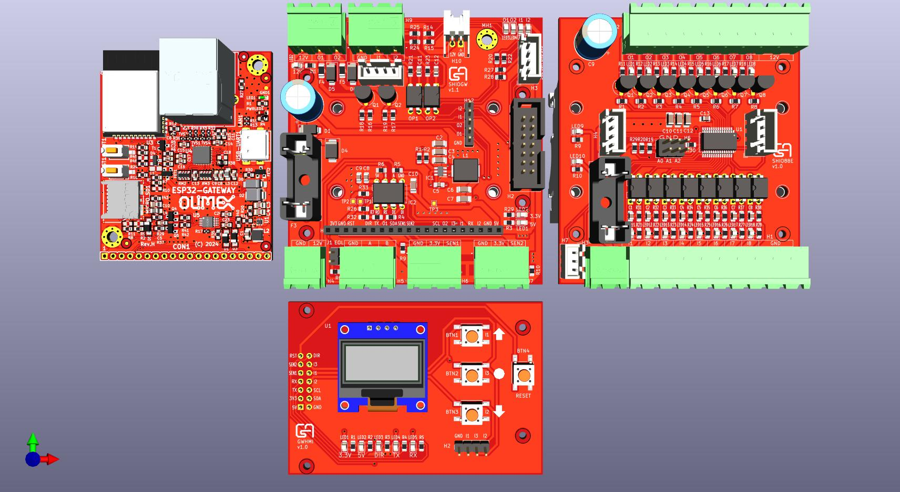
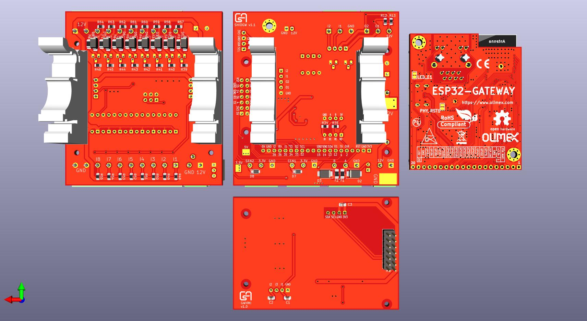

## Assembled boards

The SMD components sitting on the front side of the SHIOGW and SHIOE boards manufactured by JLCPCB SMT assembly.

Fits into home distribution boxes:

## SHIOGW and Olimex Gateway

## SHIO88E

## 3D images

