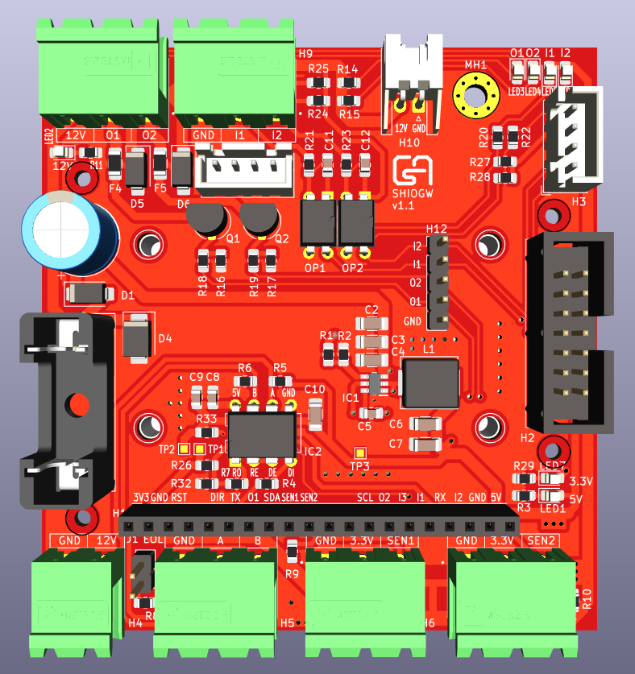
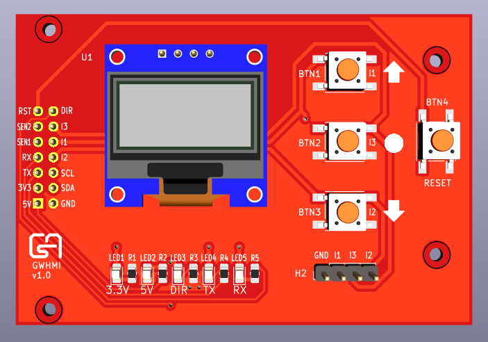
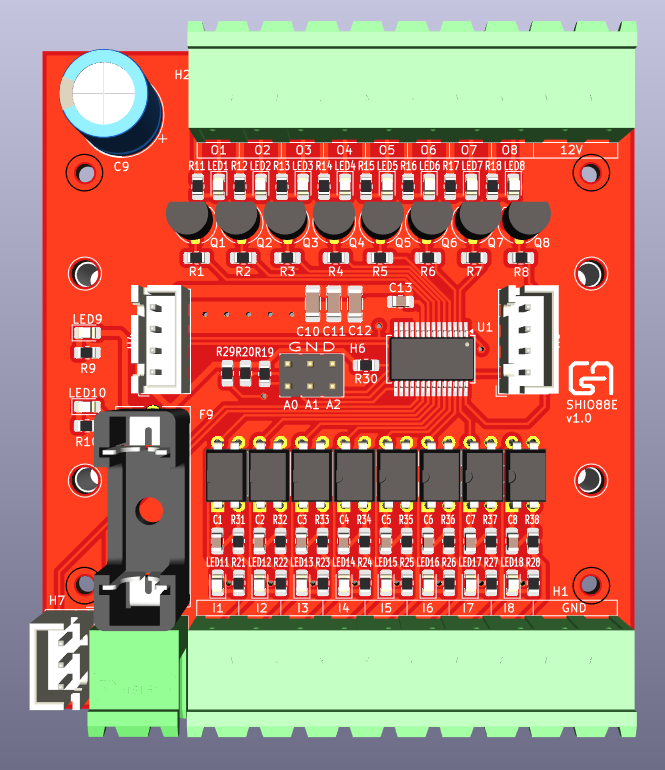

# [SHIOGW](/Hardware/SHIOGW)

DIN rail mount extension board for [Olimex ESP32-GATEWAY](https://www.olimex.com/Products/IoT/ESP32/ESP32-GATEWAY/open-source-hardware).

More [Pictures](/Pictures#assembled-boards) and [Video](https://youtu.be/ds2y22MUNzQ) of the assembled board and extensions.

Example [ESPHome configs](/ESPHome)

## Features

* 12V to 5V step-down converter
* 2 open collector output (50 mA load per channel)
* 2 opto isolated input
* LEDs for output and input status
* 2 sensor input (ds18b20, dht)
* RS-485 interface
* 4 pin JST connector for I2C extensions
* 14 pin IDC connector for direct GPIO access

View [3D model](https://3dviewer.net/#model=https://dl.dropbox.com/scl/fi/j76wkurbdsg0v3u86ytwz/SHIOGW.wrl?rlkey=584sbdglya1lp1ddyppx6lrxc&st=6v3kh4mh&dl=0)

## Extensions

### [GWHMI](/Hardware/GWHMI)

Control interface for SHIOGW.

* PCB for 128x64 OLED display and control buttons. Fits the 0.96 and 1.3 inch OLED versions.
* Mountable top of the SHIOGW board.
* Connects to SHIOGW's 12 pin IDC connector with a small ribbon cable.
* BTN1 (up) and BTN3 (down) shared with I1 and I2 on SHIOGW main board.

View [3D model](https://3dviewer.net/#model=https://dl.dropbox.com/scl/fi/7jz3k061ucrvhpbndl225/GWHMI.wrl?rlkey=riumigwjpmmgojjbx1wv2xw0k&st=5j6r821t&dl=0)

### [SHIO88E](/Hardware/SHIO88E)

I2C IO extension.

* MCP23017 based
* 8 open collector output (50 mA load per channel)
* 8 opto isolated input
* LEDs for output and input status
* One more I2C connector to connect other device

View [3D model](https://3dviewer.net/#model=https://dl.dropbox.com/scl/fi/n3l0dhv9xatyv03qyenmx/SHIO88E.wrl?rlkey=zyxzxo8a2xjssh9ibl0cdi6ao&st=b69elw70&dl=0)

